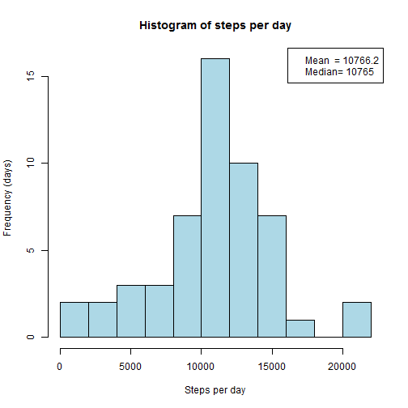
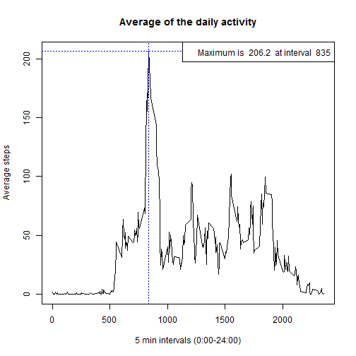
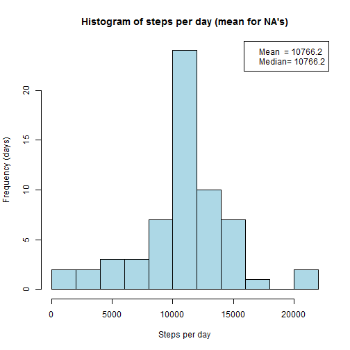
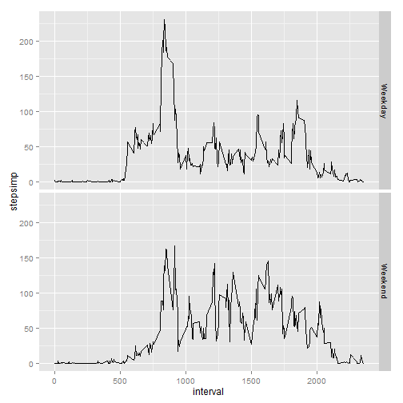

## Title: Project Assignment 1 
Course: Reproducible Research

Author: "JK"  
Last update: 16.10.2015    

--------------------------------------

### Introduction: A personal activity monitoring device

It is now possible to collect a large amount of data about personal movement using activity monitoring devices such as a Fitbit, Nike Fuelband, or Jawbone Up. These type of devices are part of the "quantified self" movement - a group of enthusiasts who take measurements about themselves regularly to improve their health, to find patterns in their behavior, or because they are tech geeks. But these data remain under-utilized both because the raw data are hard to obtain and there is a lack of statistical methods and software for processing and interpreting the data.

This assignment makes use of data from a personal activity monitoring device. This device collects data at 5 minute intervals through out the day. The data consists of two months of data from an anonymous individual collected during the months of October and November, 2012 and include the number of steps taken in 5 minute intervals each day.


### 1. Loading and preprocessing the data


```r
# Load ggplot2 lib
library(ggplot2)

# Load CSV file from the data folder
ActivityData<- read.csv("./data/activity.csv", sep=",", header=TRUE)
```

### 2. What is mean total number of steps taken per day?


```r
# Aggregate the steps for each day
StepsPerDay <- tapply(ActivityData$steps, ActivityData$date, FUN=sum)

# Calc the mean with no NA values / Create text for legend
StepsMean <- mean(StepsPerDay, na.rm=TRUE)
StepsMeanText <- paste("Mean  =", format(StepsMean,  digits=1, nsmall=1))

# Calc the median with no NA values / Create text for legend
StepsMedian <- median(StepsPerDay, na.rm=TRUE)
StepsMedianText <- paste("Median=", format(StepsMedian,  digits=1, nsmall=1))
```

The __mean__ of the total number of steps per day is: __10766.2__  

The __median__ of the total number of steps per day is: __10765__  


```r
# Plot the histogram with a legend
PlotTitle <- "Histogram of steps per day"
hist(StepsPerDay, breaks = 10, main=PlotTitle, xlab="Steps per day", ylab="Frequency (days)", col="lightblue")
legend("topright", legend= c( StepsMeanText, StepsMedianText))
```

 


### 3. What is the average daily activity pattern?


```r
# Mean of the steps for each day in the intervals
ActivityDataClean <- na.omit(ActivityData)
PatternPerDay <- tapply(ActivityDataClean$steps, ActivityDataClean$interval, FUN=mean)

# Find maximum
MaxDataset<-PatternPerDay[PatternPerDay == max(PatternPerDay)]
MaxDatasetText<-paste("Maximum is ", format(MaxDataset[1],  digits=1, nsmall=1), " at interval ", names(MaxDataset[1]))

# Plot
PlotTitle <- "Average of the daily activity"
plot(names(PatternPerDay), PatternPerDay, type="l", main=PlotTitle, xlab="5 min intervals (0:00-24:00)", ylab="Average steps")
# Add dotted lines for the max
abline(h=MaxDataset[1], v=as.numeric(names(MaxDataset[1])), col="blue", lty=3)
# Add legend
legend("topright", legend=MaxDatasetText)
```

 

The __maximum of average steps__ of the daily activity is __206.2__ 
at interval __835__ (see dotted line in the plot)


### 4. Imputing missing values  


```r
# Summarize the number of NA-values
NumberofNAs <- sum(is.na(ActivityData$steps))
```

The total number of missing values (NA) is __2304__

__The strategy for filling all the missing values in the dataset is to set 
the mean for that 5-minute interval.__
(Dataset is ActivityDataMean and the col is stepsimp)


```r
# Transform in Matrix and name the cols
MeanMatrix<-cbind(as.numeric(names(PatternPerDay)),PatternPerDay)
colnames(MeanMatrix) <- c("interval","mean")

# Merge ActivityData and MeanMatrix  (in each row added the mean)
ActivityDataMean <- merge(ActivityData, MeanMatrix, by=c("interval"))

# add a column and replace NA's to the mean and set all numeric steps
ActivityDataMean$stepsimp <- NA
ActivityDataMean$stepsimp[is.integer(ActivityDataMean$steps)] <- as.numeric(ActivityDataMean$steps[is.integer(ActivityDataMean$steps)])
ActivityDataMean$stepsimp[is.na(ActivityDataMean$steps)] <- ActivityDataMean$mean[is.na(ActivityDataMean$steps)]

# Aggregate the steps for each day
StepsPerDayImp <- tapply(ActivityDataMean$stepsimp, ActivityDataMean$date, FUN=sum)

# Calc the mean / Create text for legend
StepsMean <- mean(StepsPerDayImp, na.rm=TRUE)
StepsMeanText <- paste("Mean  =", format(StepsMean,  digits=1, nsmall=1))

# Calc the median / Create text for legend
StepsMedian <- median(StepsPerDayImp, na.rm=TRUE)
StepsMedianText <- paste("Median=", format(StepsMedian,  digits=1, nsmall=1))
```

The __mean__ of the total number of steps per day is: __10766.2__  

The __median__ of the total number of steps per day is: __10766.2__  


```r
# Plot the histogram with a legend
PlotTitle <- "Histogram of steps per day (mean for NA's)"
hist(StepsPerDayImp, breaks = 10, main=PlotTitle, xlab="Steps per day", ylab="Frequency (days)", col="lightblue")
legend("topright", legend= c( StepsMeanText, StepsMedianText))
```

 

### 5. Are there differences in activity patterns between weekdays and weekends?


```r
# Add another col for the weekday
ActivityDataMean$weekday <- weekdays(as.Date(ActivityDataMean$date))
# and a col for identifying the weekend
ActivityDataMean$weekend <- (ActivityDataMean$weekday == "Samstag") | (ActivityDataMean$weekday == "Sonntag")
# and add a col to identify type of day
ActivityDataMean$dayType <- "NA"
ActivityDataMean$dayType[ActivityDataMean$weekend==FALSE] <- "Weekday"
ActivityDataMean$dayType[ActivityDataMean$weekend==TRUE] <- "Weekend"

# Create the Mean by steps and weekend
PatternPerDayType<- aggregate(stepsimp ~ dayType+ interval, data = ActivityDataMean, FUN=mean)

# Plot data
PlotTitle <- "Activity patterns between weekdays and weekends"

g<-ggplot(PatternPerDayType, aes(interval, stepsimp))+
    geom_line() + facet_grid( dayType~.)
plot(g)
```

 
